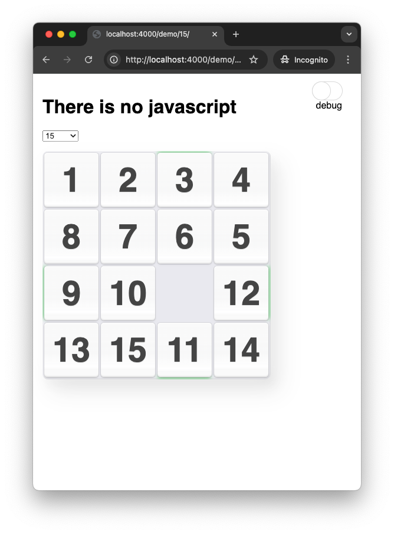

title: Пятнашки на CSS
layout: post
date: 2023-02-26
tags:
  - crazydev
  - CSS
  - gamedev
---

*Игра "15" на чистом CSS, без единой строчки на javascript*

[Демо](/demo/15/)


<!--more-->

## Начало

Для начала создадим `index.html`. Нам будет нужна доска (`.board`) 
и на ней разместим 15 костяшек (tiles: `#t01`, `#t02`, ... `#t15`)

```html
<!DOCTYPE html>
<html>
<body>
  <div class="board">
    <div id="t01">
      <span>1</span>
    </div>
    <div id="t02">
      <span>2</span>
    </div>
    ...
    <div id="t15">
      <span>15</span>
    </div>
  </div>
</body>
</html>
```

Для управления будем использовать radio-кнопки. Для каждой из 15-ти костяшек
придется создать группу из 16-ти radio-кнопок, по количеству ячеек в игре.

Чтобы состояние кнопок могло оказывать воздействие на доску, все кнопки 
надо расположить **выше** элемента с доской, и нельзя их помещать ни в какой элемент.
Тогда с помощью селектора `~` и псевдокласса `:checked` можно будет считывать состояние
игры.

15 групп из 16 кнопок дают нам `15¹⁶` возможных состояний. В таком режиме не исключены варианты, что
две костяшки могут находиться в одной позиции. Но это дает большое упрощение для написания логики.

Так что создадим 16*15 radio-кнопок, каждой группе дадим уникальное имя 
(`name`=`c01`, `c02`...`c15` - controls), также дадим контролам css классы 
(`x1`...`x4` - означает что контрол управляет соответствующим столбцом костяшки 1-4, `y1`-`y4` - строкой)

```html
<body>
                <!-- для первой костяшки -->
  <input type="radio" class="c01 y1 x1" name="c01" value="11" id="c01-11"/> <!-- y=1, x=1 -->
  <input type="radio" class="c01 y1 x2" name="c01" value="12" id="c01-12"/> <!-- y=1, x=2 -->
  <input type="radio" class="c01 y1 x3" name="c01" value="13" id="c01-13"/> <!-- y=1, x=3 -->
  <input type="radio" class="c01 y1 x4" name="c01" value="14" id="c01-14"/> <!-- y=1, x=4 -->
  <input type="radio" class="c01 y2 x1" name="c01" value="21" id="c01-21"/> <!-- y=2, x=1 -->
  ...           <!-- еще 11 кнопок -->

  <br/>         <!-- для второй костяшеки -->
  <input type="radio" class="c02 y1 x1" name="c02" value="11" id="c02-11"/>
  <input type="radio" class="c02 y1 x2" name="c02" value="12" id="c02-12"/>
  ...
  ...
  <!-- для 15-ой костяшки -->
  <input type="radio" class="c15 y4 x4" name="c15" value="44" id="c15-44"/> <!-- y=4, x=4 -->
>
```

## Позиционируем костяшки

Добавим к элементу `.board` css-переменные с `x` и `y` координатами каждой костяшки. Итого будет 32 переменные.
Переменные будут вида `--c01-x` для `x`-координаты первой костяшки (может принимать значения `1`, `2`, `3`, `4`, в зависимости от столбца, с котором она находится, либо `0` если не инициализирована)

Сначала проинициализируем все переменные в `0`:

```css
.board { 
  --c01-x: 0; --c01-y: 0;
  --c02-x: 0; --c02-y: 0;
  --c03-x: 0; --c03-y: 0;
  ...
}
```

А затем напишем по 4 правила на каждую их 30-ти переменных, которые выставят значение

```css
.c01.x1:checked ~ .board { --c01-x: 1; }   /* нажата radio-кнопка #c01-x1, значит x-координата равна 1 */ 
.c01.x2:checked ~ .board { --c01-x: 2; } 
.c01.x3:checked ~ .board { --c01-x: 3; } 
.c01.x4:checked ~ .board { --c01-x: 4; } 
.c01.y1:checked ~ .board { --c01-y: 1; }  /* то же самое для y-координаты */
.c01.y2:checked ~ .board { --c01-y: 2; } 
.c01.y3:checked ~ .board { --c01-y: 3; } 
.c01.y4:checked ~ .board { --c01-y: 4; }

.c02.x1:checked ~ .board { --c02-x: 1; }
...

.c15.y4:checked ~ .board { --c15-y: 4; }  /* последнее правило: y-координата 4 для 15-ой костяшки
```

Все эти переменные нам понадобятся для вычисления координаты пустой ячейки, но пока для каждой костяшки
скопируем в ее элемент ее координаты.

Например, у `div#t01` соответствующего первой костяшке, выставим переменные `--x` и `--y` равным ее координатам, то есть, равным `--c01-x` и `--c01--y` 

```css
#t01 { --x: var(--c01-x); --y: var(--c01-y); }
#t02 { --x: var(--c02-x); --y: var(--c02-y); }
...
#t15 { --x: var(--c15-x); --y: var(--c15-y); }
```

Добавим немножнко стилей. У элемента `.board` зададим ширину `4em`, чтоб удобнее было управлять размером
и позиционированием костяшек. Каждая из них будет иметь размер `1em` x `1em`, спозиционированная 
абсолютно, с координатами `0em`, `1em`, `2em` или `3em`

```css
.board {
  position: relative;
  width: 4em;
  height: 4em;
  border: 1px solid red;
  font-size: 64px;
  overflow: hidden;
}

.board > div { 
  position: absolute; 
  width: 1em; 
  height: 1em; 
  border: 1px solid #ccc; 
  left: calc((var(--x) - 1) * 1em);       /* координаты вычисляем от переменных x и y */
  top: calc((var(--y) - 1) * 1em);        /* и переводим в em */
  transition-property: left, top;
  transition-duration: 0.2s;
  display: flex;
  justify-content: center;
  align-items: center;
} 
```

В итоге получим такую страничку:



Пока что нам нужно вручную нажать на radio-кнопки, чтоб костяшки оказались на доске.


## Вычисляем координаты свободной ячейки

Для вычисления, куда двигать костяшку при нажатии, потребуется знание того, какая из ячеек является 
свободной. У нас уже есть `x` и `y` координаты каждой костяшки. При правильной расстановке всех 
костяшек на доске, так, что никакие две костяшки не находятся в одной ячейке, оказывается, что
просуммировав все координаты всех 15-ти костяшек и прибавить к ним координату свободной ячейки,
мы получим 40. Мы получим четыре единички, четыре двойки, четыре тройки и четыре четверки.

Поэтому, отняв от 40 координаты всех костяшек, мы получим соответствующую координату свободной ячейки

```css
.board {
  --free-x: calc( 40 - var(--c01-x) - var(--c02-x) - var(--c03-x)
      - var(--c04-x) - var(--c05-x) - var(--c06-x) - var(--c07-x)
      - var(--c08-x) - var(--c09-x) - var(--c10-x) - var(--c11-x)
      - var(--c12-x) - var(--c13-x) - var(--c14-x) - var(--c15-x) );
  --free-y: calc( 40 - var(--c01-y) - var(--c02-y) - var(--c03-y) 
      - var(--c04-y) - var(--c05-y) - var(--c06-y) - var(--c07-y) 
      - var(--c08-y) - var(--c09-y) - var(--c10-y) - var(--c11-y) 
      - var(--c12-y) - var(--c13-y) - var(--c14-y) - var(--c15-y) );
}
```

## Обрабатываем щелчки

По щелчку на костяшку мы должны поменять ее координату, то есть, в терминах нашей модели,
нужно поменять одну из radio-кнопок. Чтобы этого добиться, мы можем воспользоваться элементом
`<label for="...">`.

В каждый из 15-ти элементов для костяшки положим 16 элементов `label` соответствующих ее radio-кнопкам.
Также для ужобство каждой из label дадим классы `x1`...`x4` и `y1`...`y4` по координатам, которыми она управляет.

```html
  <div class="board">
    <div id="t01">                                <!-- костяшка 1 -->
      <span>1</span>
      <label class="y1 x1" for="c01-11"></label>  <!-- для radio с координатами (1, 1) -->
      <label class="y1 x2" for="c01-12"></label>  <!-- для radio с координатами (1, 2) -->
      <label class="y1 x3" for="c01-13"></label>
      <label class="y1 x4" for="c01-14"></label>
      ...
    </div>
    ...
    <div id="t15">                                <!-- костяшка 1 -->
      <span>15</span>
      ...
      <label class="y4 x4" for="c15-44"></label>  <!-- для radio с координатами (4, 4) -->
    </div>
  </div>
```

Нам нужно чтоб только один из `label` был доступен для клика. Спозиционируем их всех абсолютно,
и будем вычислять их координаты, в зависимости от текущей свободной ячейки.


```css
.board > div { overflow: hidden; } 
.board > div > label { position: absolute; width: 100%; height: 100%; cursor: pointer; }

label.x1 { left: calc((1 - var(--free-x)) * 1em); }
label.x2 { left: calc((2 - var(--free-x)) * 1em); }
label.x3 { left: calc((3 - var(--free-x)) * 1em); }
label.x4 { left: calc((4 - var(--free-x)) * 1em); }

label.y1 { top: calc((1 - var(--free-y)) * 1em); }
label.y2 { top: calc((2 - var(--free-y)) * 1em); }
label.y3 { top: calc((3 - var(--free-y)) * 1em); }
label.y4 { top: calc((4 - var(--free-y)) * 1em); }
```

Смысл здесь следующий: в каждой костяшке, размер которой равен `1em` находятся 16 элементов, тоже размера `1em`
спозицинированных по разным координатам. Но, из за `overflow: hidden` будет "видна" только одна, у которой
вычисленные координаты `left` и `top` обе равны нулю. 

А для костяшки с координатой `x` выражение `x - free-x` будет равно нулю при их равенстве.

Поэтому, например, для всех `label` с классом `x1`, то есть, отправляющих костяшку по координатам `1`, эта
`label` будет видна (`left: 0`) только если `free-x = 1`. Аналогично для всех других.

Теперь если нажать на все radio-кнопки так, чтоб все костяшки оказались на поле и не накладывались
друг на друга, по клику костяшки будут перемещаться в свободное поле. Но, пока что, можно щелкнуть по любой костяшке, никакой проверки того, что поле рядом, нет.

## Добавляем проверку костяшки, соседней с пустым полем


Для удобства добавим каждой костяшке переменные `--dx` и `--dy` равные смещению этой костяшки от свободной ячейки. Ранее мы добавляли костяшкам `--x` и `--y`, поэтому вычислим их так:

```css
.board > div {                            /* для каждой костяшки */
  --dx: calc(var(--x) - var(--free-x));   /* dx = x - free-x  - смещение от свободной */
  --dy: calc(var(--y) - var(--free-y));   /* dy = y - free-y */
}
```

Нам нужно добиться того, чтоб `|dx|=1` либо `|dy|=1`. Мы оперируем смещением `label`, и при таких значениях смещение должно быть нулем. А при других значениях должно быть ненулевым.

Модуля в css нет, но мы можем возвести в квадрат (то есть, домножить на себя). Тогда сложив `dx²` и `dy²` мы должны будем получить `1`. Отняв единицу, получим искомое нулевое смещение.

В этом рассуждении есть небольшая ошибка. Например, если `dx=2` а `dy=0`, после этих вычислений мы получим смещение `4 - 1 = 3`. Но может так оказаться, что сдвинув все `label` на это смещение, по координатам 0 все же окажется другая `label` вычисленная по формуле `x - free-x`. Поэтому домножим все слагаемые в нашей формуле
на некоторое число, больше общей ширины доски, например, на `10`

Тогда смещение будет `10 * dx² + 10 * dy² - 10`, и оно будет:
- либо равно нулю, если одно из значений `dx` или `dy` равно единице, а другое нулю (т.е. ячейка соседняя со свободной)
- либо равно достаточно большому числу, такому, что все `label` сильно сместятся от координаты `0`

```
.board > div {
  --dx: calc(var(--x) - var(--free-x));
  --dy: calc(var(--y) - var(--free-y));
  --sq-diff: calc(10 * var(--dx) * var(--dx) + 10 * var(--dy) * var(--dy) - 10);
}
label.x1 { left: calc((1 - var(--free-x) + var(--sq-diff)) * 1em); }
label.x2 { left: calc((2 - var(--free-x) + var(--sq-diff)) * 1em); }
label.x3 { left: calc((3 - var(--free-x) + var(--sq-diff)) * 1em); }
label.x4 { left: calc((4 - var(--free-x) + var(--sq-diff)) * 1em); }
```

Кстати, это смещение достаточно сделать лишь для одной из координат.

Теперь щелкаются костяшки только смежные с пустой ячейкой.

## Генератор случайных чисел

Для начально расположения нам надо каким-то случайным образом заполнить начальные значения для всех
radio-кнопок. Но случайных числел в css тоже нет. Поэтому мы попросим пользователя 16 раз щелкнуть по 
полю, а под мышку будем подставлять разные <label> для radio-кнопок.

